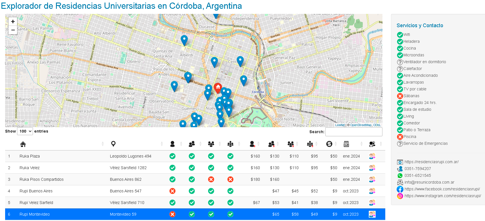
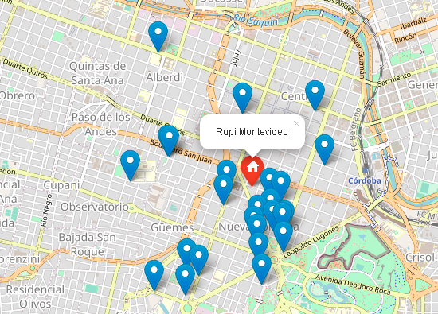
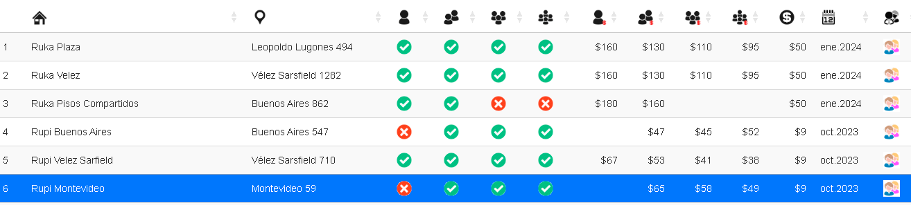
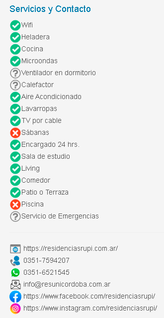

# residencias-universitarias-shiny
A Shiny web application for exploring university residences in Cordoba, Argentina.

Este proyecto es un explorador interactivo de residencias universitarias en la ciudad de Córdoba, Argentina. Permite a los usuarios visualizar y filtrar información sobre diversas residencias, incluyendo detalles sobre habitaciones, precios, servicios y datos de contacto.

Se geolocalizan las ubicaciones en el mapa a partir de la dirección de las residencias. Se utilizan íconos para facilitar la lectura visual de la información.

### Demo
Puedes ver una demostración en vivo del proyecto [carlosmarcos.shinyapps.io](https://carlosmarcos.shinyapps.io/residencias-universitarias-cordoba/)


## Capturas de Pantalla






## Características

- Visualización en mapa de las residencias disponibles.
- Filtrado y búsqueda de residencias por nombre, ubicación y servicios.
- Detalles completos de cada residencia, incluyendo precios, servicios y datos de contacto.
- Interfaz de usuario intuitiva y amigable.

## Tecnologías

Este proyecto se ha desarrollado utilizando las siguientes tecnologías y paquetes de R:

- [Shiny](https://shiny.rstudio.com/)
- [leaflet](https://rstudio.github.io/leaflet/)
- [DT](https://rstudio.github.io/DT/)
- [ggplot2](https://ggplot2.tidyverse.org/)
- Otros paquetes de R para procesamiento de datos y visualización.

## Instalación

Puedes clonar este repositorio y ejecutar la aplicación localmente en tu máquina. Asegúrate de tener R y RStudio instalados.

Abre el archivo app.R en RStudio y ejecútalo. La aplicación se abrirá en tu navegador web predeterminado.

La fuente de datos utilizados se encuentra en el archivo "resi.xlsx" dentro de la carpeta "data".
Es posible agregar, modificar o eliminar la información en dicha planilla, y al ejecutar nuevamente la aplicación los datos se verán actualizados en pantalla.

## Mejora de rendimiento

Si ya has ejecutado la aplicación al menos una vez y continúas utilizando las mismas residencias, puedes acelerar el inicio de la aplicación comentando las siguientes líneas de código:

```r
# for (i in 1:length(resi$ubicacion)) {
#     geo_coded <-
#         geocode_OSM(stri_trans_general(
#             paste0(resi$ubicacion[i], ", Cordoba capital, provincia de cordoba,  Argentina"),
#             "Latin-ASCII"
#         ))
#     longitudes[i] <- geo_coded$coords[1]
#     latitudes[i] <- geo_coded$coords[2]
# }

# saveRDS(resi, file = "data/resi.RDS")
```

## Contribuciones
¡Las contribuciones son bienvenidas! Si deseas contribuir a este proyecto, por favor crea una solicitud de extracción (pull request) o abre un problema (issue).
